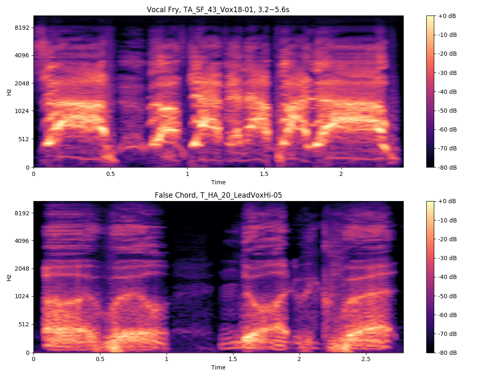
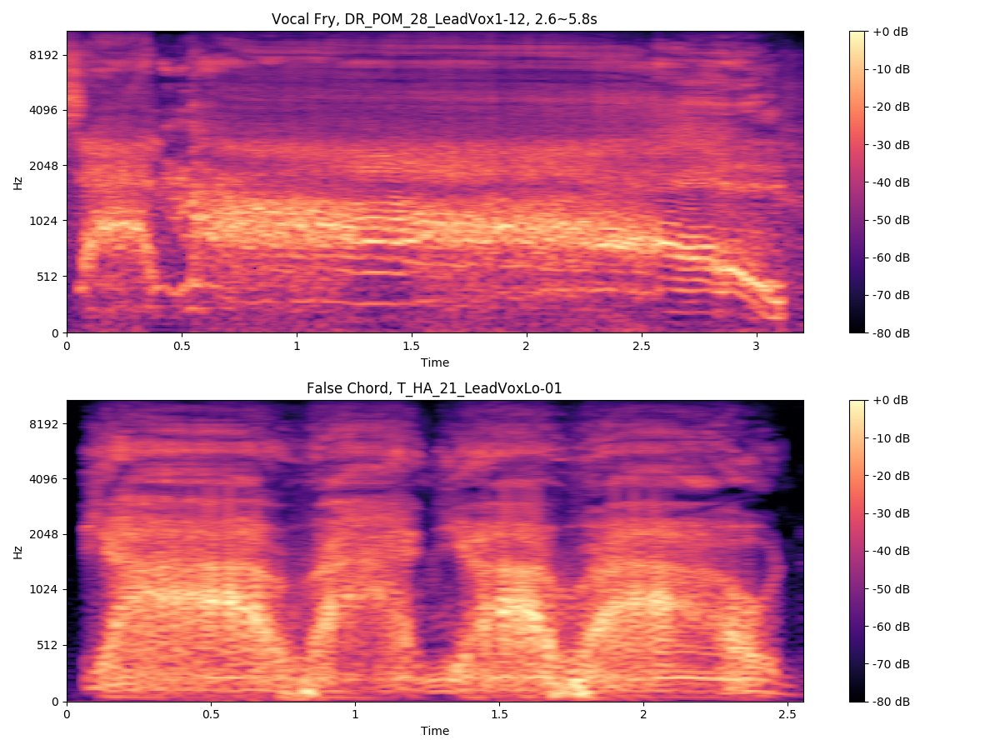
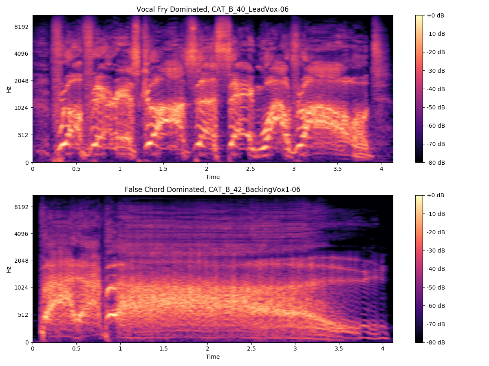
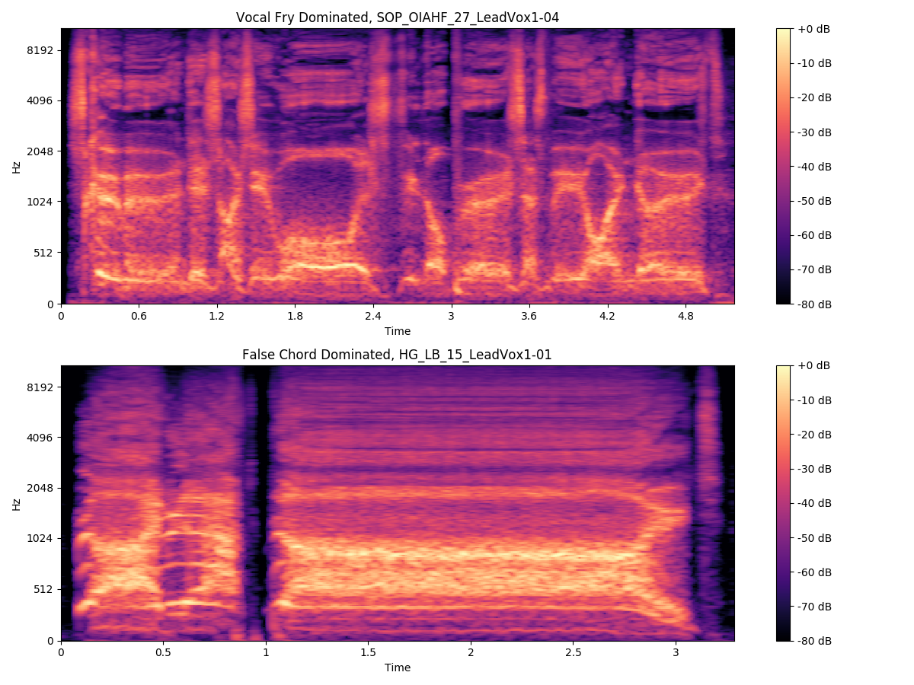
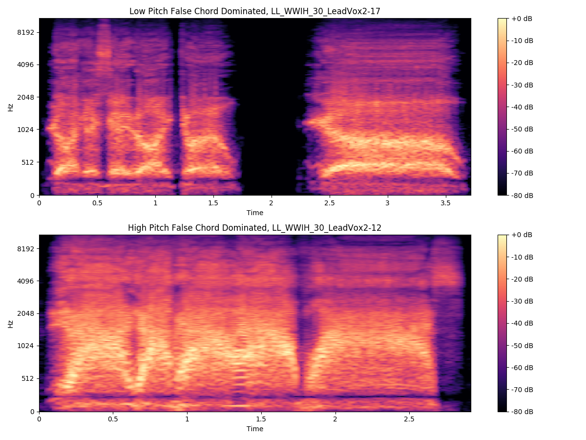
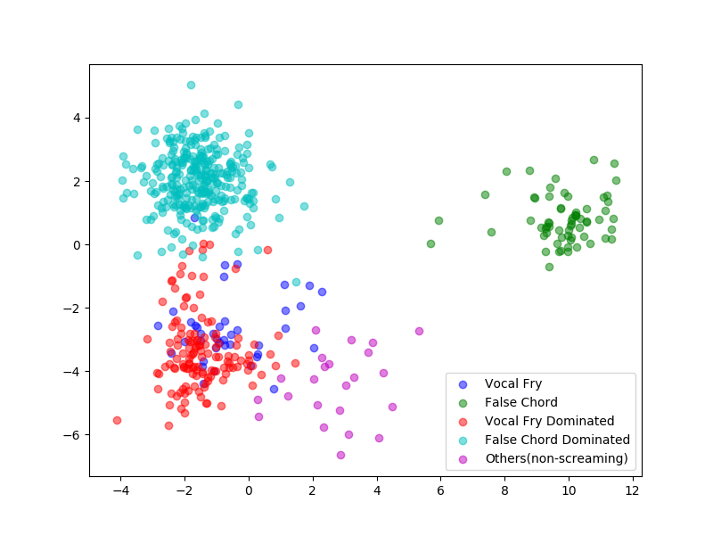
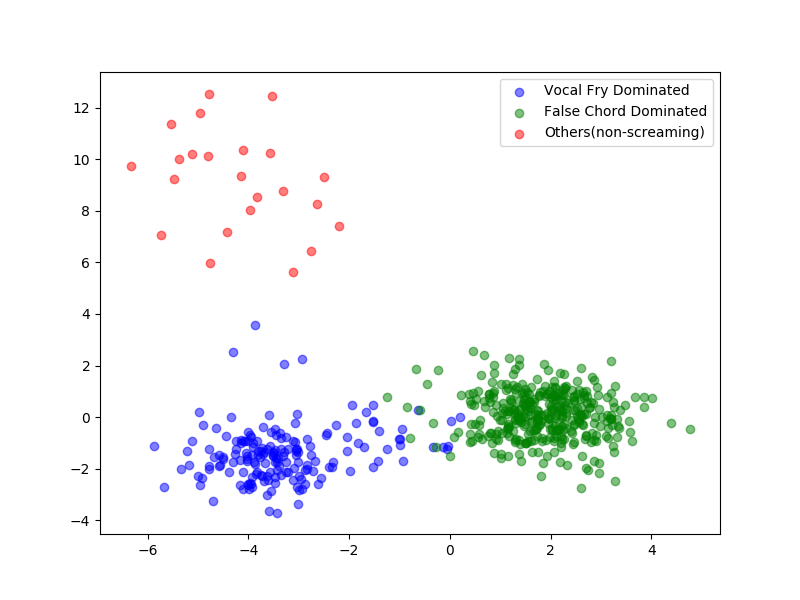

# EVA: The Extreme Vocals Archive Dataset

This is the final project I did when I was studying the MIR course in NTHU. 
I decided to do make a dataset full of screaming vocals samples, because this kind of vocals is less concerned in the MIR field.
The making of this dataset may be a starting point for future research.

## Raw audio

I pick up 16 songs as listed below  from [The 'Mixing Secrets' Free Multitrack Download Library](http://www.cambridge-mt.com/ms-mtk.htm), 
and used audacity to slice vocal tracks into small clips, ended up with 565 of samples.

```
The Apprehended: 'Still Flyin'
Cnoc An Tursa: 'Bannockburn'
The Complainiacs: 'Etc'	
Dark Ride: 'Burning Bridges'
Dark Ride: 'Hammer Down'
Dark Ride: 'Piece Of Me'
Death Of A Romantic: 'The Well'
Decypher: 'Unseen'
Headwound Harry: 'XXXV'
Hollow Ground: 'Ill Fate'
Hollow Ground: 'Left Blind'
Last Legacy: 'Who's Who In Hell'
Storm Of Particles: 'Of Ice And Hopeless Fate'
Timboz: 'Pony'
Titanium: 'Haunted Age'
Wall Of Death: 'Femme'
```

I named each clips using initials, so the first clips from the track `43_Vox18.wav` in _The Apprehended - Still Flyin_ 
is named as `TA_SF_43_Vox18_01.wav`, etc. I can't provide the raw audio, but you can use the files in [mark_time](mark_time) 
which contain the start time and end time of each clips, to manually recreate them.

## Data

* [annotations](annotations.csv): the vocal techniques of each samples, labeled by metal youtuber [Edward].
* [features](features.csv): audio features (except chroma related) extracted with [librosa].

[Edward]: https://www.youtube.com/channel/UCu1FDV-RQS8V3s82RuNmOWg
[librosa]: https://librosa.github.io/librosa/

## Code

Require pandas, sklearn, matplotlib and librosa be installed.

1. [get_features](get_features.py): features extraction from the audio (used to create `features.csv`). 
Most of the code are borrowed from [FMA](https://github.com/mdeff/fma/blob/master/features.py).
2. [analysis](analysis.py): show the melspectrogram of some samples. Require raw audio files.
3. [baseline](baseline_svm.py): baseline svm model for vocal techniques recognition.

## Melspectrogram of some samples








## Samples distribution after dimension reduction using LDA




## Environment

* ubuntu 16.04 LTS
* python3.5.2 (using Pycharm 2018.1.4)

I also wrote a [report](report.pdf) in chinese about the making process.
